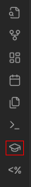
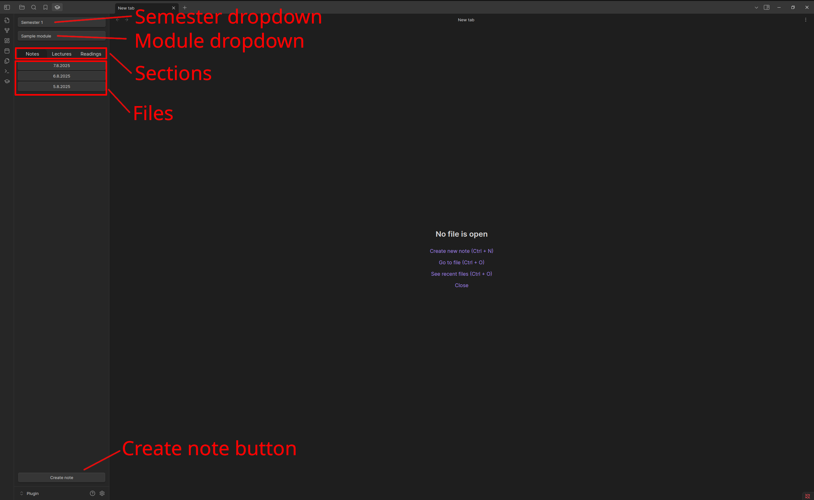
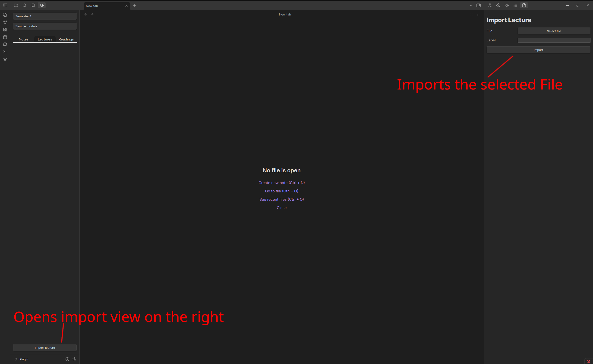

# Usage

## Settings

| Attribute | Description                                                                                                                                              |
| --------- | -------------------------------------------------------------------------------------------------------------------------------------------------------- |
| Locale    | The locale is used to apply the locale date format to the labelling of notes. [Here](https://simplelocalize.io/data/locales/) is a list of locale codes. |
| Semesters | Count of semesters you have. (The Tool is designed for a complete course of study).                                                                    |

**Semester attributes**

The following attributes are per semester.

| Attribute     | Description                                 |
| ------------- | ------------------------------------------- |
| Modules Count | Sets the number of modules\* in a semester. |

> \*The modules can be set after the module count has been set.

## Main

> Make sure, you configured this Tool first. See [settings](#settings)

To use this Tool, you have to open the university view by clicking on the graduation icon on the left.


> Sidebar with the graduation icon

### University-Tool-View

In the University Tool View, you can select with the dropdowns the semester and module. 

There are 3 sections for each module (`Notes`,`Lectures`,`Readings`).

The `Notes`-Section does create notes by creating on `Create Note`. The Tool will then create a normal markdown file (the file who the user is editing) under the selected semester and module. Note: In the file browser will be file created with the iso date format, but the file viewer shows the locale date (due of the locale setting).



#### Import-File

> This is for the `Lectures` and `Readings` section.

Here you can see, there is no file creation button, but a import button at the bottom. This opens a new view on the right side.


At the import view, you can select a file over the button `Select file` (currently only pdfs accepted & one file per time).
The view expects a label. This is required, due the Tool shows the label and not the file name in the file selection.



#### Open a file

> For any section.

Any section in the university view has a file list, as shown in the [first picture at the top](#university-Tool-view). With a `left-click` you can open the file in the same tab. With a `middle-click`/`mousewheel-click` you can open the file in a new tab.

## Highlevel usage

In every `notes`, `readings` & `lectures` folder (only seeable in a normal file explorer), you can see a file called `meta.json`. 
It follows the following structure:
```json
{
    "files":[
        {
            "basename": "basename",
            "extension": "extension",
            "name": "basename.extension",
            "path": "Semester X/Module/section/basename.extension",
            "label": "label",
            "index": 0,
            "date": "ISO-DateTime (YYYY-MM-DDTHH:mm:SS.ssss)"
        }
        ...
    ]
}
```

All attributes are needed.

## Sources

[Simplelocalize.io](https://simplelocalize.io/data/locales/)
